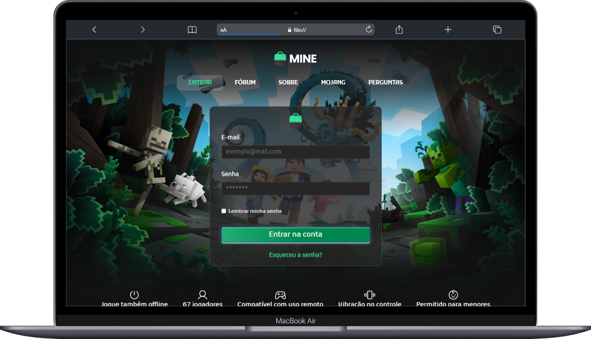

# Codelândia - Minecraft Project 🚀 EN

This is my first project on GitHub and I'm very excited to share it with you! 😃 This project was created as a way to apply and improve my knowledge in HTML, CSS, and JavaScript.

  

    
🖥️ Desktop

    
  

  

    
<b>📱 Mobile</b>

    
  

## How to use 🤔

1. Download or clone the repository to your local machine.
2. Open the index.html file in your internet browser.
3. Explore the website and have fun! 😊

I would like to thank my collaborator 💜 for her help in making this project a reality. It was a great experience working with her and learning from her skills. I hope this collaboration is the first of many successful projects together.

If you have any questions, comments or suggestions, feel free to contact me or my collaborator. We are always looking to improve and appreciate constructive feedback. 🙏

Thank you for checking out my HTML, CSS, and JavaScript project! 😊

---
*The design of this project is based on challenge 32 "Mine Project" from the Codelândia community, created by Iuri Silva. 🎨*

⠀⠀⠀⠀⠀

# Codelândia - Projeto Mine 🚀 PT-BR

Este é meu primeiro projeto no GitHub e estou muito animado em compartilhá-lo com vocês! 😃 Este projeto foi criado como uma forma de aplicar e aprimorar meus conhecimentos em HTML, CSS e JavaScript.

## Como usar 🤔

1. Faça o download ou clone o repositório em sua máquina local.
2. Abra o arquivo `index.html` em seu navegador de internet.
3. Explore o site e divirta-se! 😊

Gostaria de agradecer à minha colaboradora 💜 por sua ajuda em tornar este projeto realidade. Foi uma ótima experiência trabalhar com ela e aprender com suas habilidades. Espero que esta colaboração seja o primeiro de muitos projetos bem-sucedidos juntos.

Se você tiver alguma dúvida, comentário ou sugestão, sinta-se à vontade para entrar em contato comigo ou com minha colaboradora. Estamos sempre procurando melhorar e agradecemos feedback construtivo. 🙏

Obrigado por conferir o meu projeto de HTML, CSS e JavaScript! 😊

---
*O design deste projeto é baseado no desafio 32 "Projeto Mine" da comunidade Codelândia, criada por Iuri Silva.* 🎨

