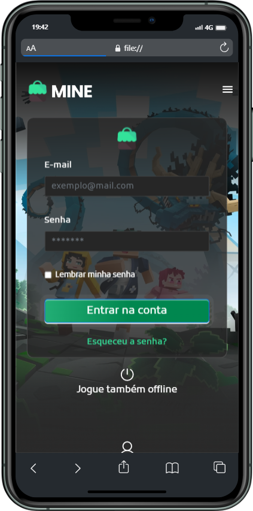

# Codelândia - Projeto Mine 🚀

Este é meu primeiro projeto no GitHub e estou muito animado em compartilhá-lo com vocês! 😃 Este projeto foi criado como uma forma de aplicar e aprimorar meus conhecimentos em HTML, CSS e JavaScript.

  
Capturas de tela do projeto em execução

  

    
🖥️ Desktop

    
  

  

    
📱 Mobile

    
  

## Como usar 🤔

1. Faça o download ou clone o repositório em sua máquina local.
2. Abra o arquivo `index.html` em seu navegador de internet.
3. Explore o site e divirta-se! 😊

Gostaria de agradecer à minha colaboradora 💜 por sua ajuda em tornar este projeto realidade. Foi uma ótima experiência trabalhar com ela e aprender com suas habilidades. Espero que esta colaboração seja o primeiro de muitos projetos bem-sucedidos juntos.

Se você tiver alguma dúvida, comentário ou sugestão, sinta-se à vontade para entrar em contato comigo ou com minha colaboradora. Estamos sempre procurando melhorar e agradecemos feedback construtivo. 🙏

Obrigado por conferir o meu projeto de HTML, CSS e JavaScript! 😊

---
*O design deste projeto é baseado no desafio 32 "Projeto Mine" da comunidade Codelândia, criada por Iuri Silva.* 🎨

